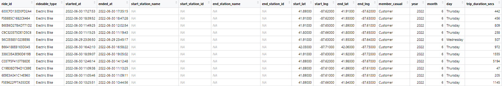
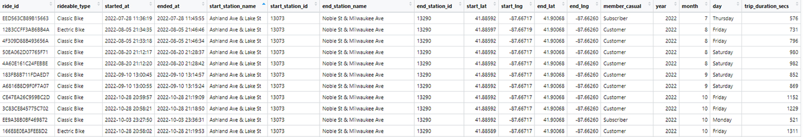
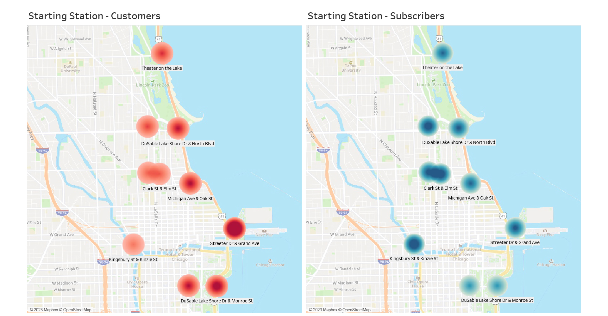
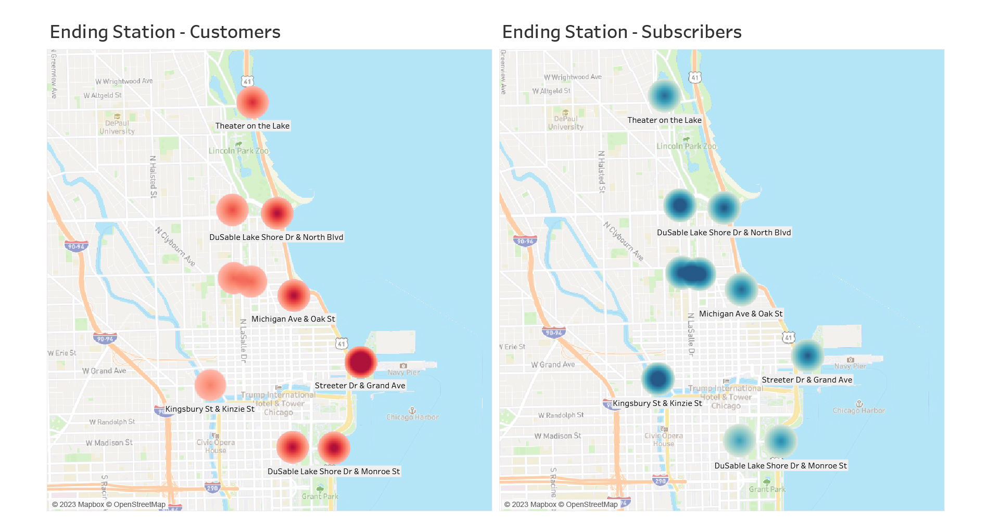
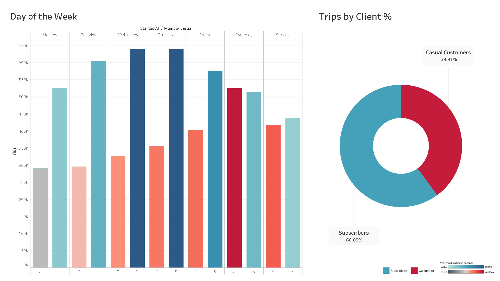
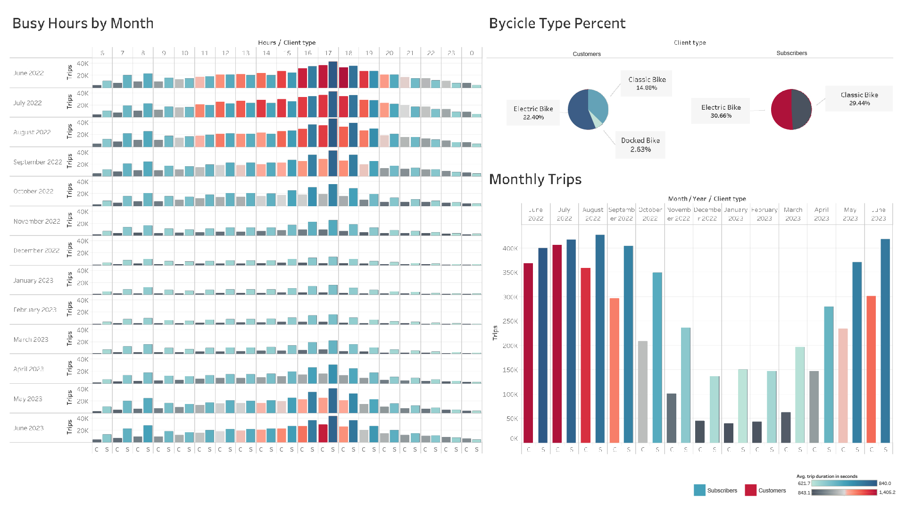

# Data Analysis Case Study: Uncovering a bicycle rental company trends

## Introduction

Welcome to the Cyclistic Data Analysis Case Study! In this project, we will analyze the historical bike trip data from Cyclistic, a successful bike-share program in Chicago. The main goal of this analysis is to help the marketing team design effective strategies to convert casual riders into annual members. By understanding the differences between annual members and casual riders and exploring the reasons why casual riders might buy annual memberships, we can guide marketing efforts to maximize the number of annual members, which the finance analysts have determined to be more profitable for Cyclistic.

## About the Company

In 2016, Cyclistic launched a bike-share program that has now grown to include a fleet of 5,824 bicycles across 692 stations in Chicago. The program offers customers the flexibility of single-ride passes, full-day passes, and annual memberships. While casual riders purchase single-ride or full-day passes, annual members are loyal subscribers. The marketing team, led by Lily Moreno, aims to attract and retain more annual members as a key strategy for future growth.

## Scope of Work

To achieve the marketing goals, our analysis will focus on the following deliverables:

1. A clear statement of the business task.
2. A description of all data sources used.
3. Documentation of any data cleaning or manipulation.
4. A summary of our analysis.
5. Supporting visualizations and key findings.
6. Top three recommendations based on our analysis.

## Ask Phase: Statement of the Business Task

The primary business task is to design marketing strategies aimed at converting casual riders into annual members. To achieve this, we will explore how annual members and casual riders use Cyclistic bikes differently, why casual riders would be interested in purchasing annual memberships, and how digital media could influence their decision to become members. The insights gained from this analysis will help guide targeted marketing efforts towards casual riders.

### Questions to Guide the Analysis:

1. How do annual members and casual riders use Cyclistic bikes differently?
2. Why would casual riders buy Cyclistic annual memberships?
3. How can Cyclistic use digital media to influence casual riders to become members?

### Primary Stakeholders:

* Lily Moreno - Director of Marketing.
* Cyclistic Executive Team.

### Secondary Stakeholders:

* Marketing Analytics Team (my crew 😛)

## Prepare Phase: Description of All Data Sources

**Dataset:** The data for our analysis is sourced from divvy-tripdata, available in CSV format. The dataset has been provided by Motivate International Inc. and is accessible under their specified license agreement. It is important to note that the data does not include personally identifiable information, ensuring the privacy of the riders.

### Data Integrity and Credibility:

**Dataset:**

[2206-2306-cyclistic-tripdata](https://www.kaggle.com/datasets/diegosnbr/2206-2306-cyclistic-tripdata) to access the dataset. For this project, we'll be working with data from June 2022 to June 2023. The data it’s in CSV format, and has been made available by Motivate International Inc. under this [license](https://divvy-tripdata.s3.amazonaws.com/index.html). Note that data-privacy issues prohibit the use of riders’ personally identifiable information, making it impossible to link trips to specific riders, in case casual riders purchase multiple single passes.

**Data integrity and credibility:**

The data has been evaluated using the "ROCCC" system to assess its credibility and integrity:

1. **Reliability:** The data is complete and free of duplicate entries, but it lacks information to account for bias.
3. **Originality:** The data is original and directly collected by Motivate LLC, a company that services bicycle sharing systems in North America.
4. **Comprehensiveness:** The data may not be comprehensive enough to cover all variables needed for a fair analysis.
5. **Current:** The data is updated monthly up to 2013, making it current.
6. **Cited:** The data includes all relevant sources and responsible parties.

Overall, the data integrity is acceptable but may have limitations in providing comprehensive insights due to potential biases. Any conclusions drawn from here only can lead to unfairness, and thus have to be further confirmed though a more reliable dataset.

**Data Usefulness:**

The dataset covers bike trip data from June 2022 to June 2023, comprising a substantial 6,548,648 rows summed up. This is a great amount of data points, all meaningful for the analysis.

**Data Organization:**

Each of the CSV files contain 13 columns. The variables include ride_id (character), rideable_type (character), started_at (date and time), ended_at (date and time), start_station_name (character), among others. The data represents information about individual bike trips, including details like ride identifiers, bike type, timestamps for starting and ending trips, station names and IDs, including geological data, and whether the rider is a casual or member customer.

### Combining the Data

RStudio Desktop will be used for merging, cleaning and processing the data. Considering the volumen of 6.5 million rows, platforms like Excel, Google Sheets, or the free version of BigQuery, are all ruled out. With RStudio, we are able to do the whole data manipulation process.

In this section, we are preparing the R environment for our data analysis by installing and loading necessary packages (tidyverse, skimr, janitor, lubridate and here). We are also setting the working directory to the appropriate location where our datasets are stored. Next, we load the CSV files containing the bike trip data from Cyclistic for different months in the year 2022 and 2023. We then combine all the individual monthly data frames into one large data frame called ´cyclistic_yearlytrips_2206_2306´.

```r
# Let's install the packages

install.packages("tidyverse")
install.packages("skimr")
install.packages("janitor")
install.packages("lubridate")
install.packages("here")

# Loading libraries.

library("tidyverse")
library("skimr")
library("janitor")
library("lubridate")
library("here")
```
```r
# Setting the work space directory.

setwd(here())
getwd()

# Loading the CSV files

cyclistic_22_06 <- read_csv(here("0_Datasets/2206-2306-cyclistic-tripdata/2206-cyclistic-tripdata.csv"))
cyclistic_22_07 <- read_csv(here("0_Datasets/2206-2306-cyclistic-tripdata/2207-cyclistic-tripdata.csv"))
cyclistic_22_08 <- read_csv(here("0_Datasets/2206-2306-cyclistic-tripdata/2208-cyclistic-tripdata.csv"))
cyclistic_22_09 <- read_csv(here("0_Datasets/2206-2306-cyclistic-tripdata/2209-cyclistic-tripdata.csv"))
cyclistic_22_10 <- read_csv(here("0_Datasets/2206-2306-cyclistic-tripdata/2210-cyclistic-tripdata.csv"))
cyclistic_22_11 <- read_csv(here("0_Datasets/2206-2306-cyclistic-tripdata/2211-cyclistic-tripdata.csv"))
cyclistic_22_12 <- read_csv(here("0_Datasets/2206-2306-cyclistic-tripdata/2212-cyclistic-tripdata.csv"))
cyclistic_23_01 <- read_csv(here("0_Datasets/2206-2306-cyclistic-tripdata/2301-cyclistic-tripdata.csv"))
cyclistic_23_02 <- read_csv(here("0_Datasets/2206-2306-cyclistic-tripdata/2302-cyclistic-tripdata.csv"))
cyclistic_23_03 <- read_csv(here("0_Datasets/2206-2306-cyclistic-tripdata/2303-cyclistic-tripdata.csv"))
cyclistic_23_04 <- read_csv(here("0_Datasets/2206-2306-cyclistic-tripdata/2304-cyclistic-tripdata.csv"))
cyclistic_23_05 <- read_csv(here("0_Datasets/2206-2306-cyclistic-tripdata/2305-cyclistic-tripdata.csv"))
cyclistic_23_06 <- read_csv(here("0_Datasets/2206-2306-cyclistic-tripdata/2306-cyclistic-tripdata.csv"))

# We now create a new frame with all the combined data

cyclistic_yearlytrips_2206_2306 <- bind_rows(
  cyclistic_22_06,
  cyclistic_22_07,
  cyclistic_22_08,
  cyclistic_22_09,
  cyclistic_22_10,
  cyclistic_22_11,
  cyclistic_22_12,
  cyclistic_23_01,
  cyclistic_23_02,
  cyclistic_23_03,
  cyclistic_23_04,
  cyclistic_23_05,
  cyclistic_23_06
)

# At last, we inspect the resulting data frame

str(cyclistic_yearlytrips_2206_2306)
```
This is the printed version of the cyclistic_yearlytrips_2206_2306:


## Process Phase: Cleaning it all

In this section, we perform data cleaning and manipulation tasks. First, we recode the values in the columns 'member_casual' and 'rideable_type' to have more descriptive names ("Subscriber" instead of "member" and "Classic Bike" instead of "classic_bike," etc.). Next, we create new columns for 'year', 'month', and 'day' extracted from the 'started_at' column using the lubridate package. Additionally, we calculate the trip duration in seconds and add a new column 'trip_duration_secs' to the data frame. Some trips had negative durations, because they were taken out for maintenance. We want to filter those trips, and at last, create a cleaned data frame called clean_yearlytrips.
```r
# Let's change the name of the variables inside 'member_casual'so it's more readable

cyclistic_yearlytrips_2206_2306 <- cyclistic_yearlytrips_2206_2306 %>%
  mutate(member_casual=recode(member_casual,
                              "member"="Subscriber",
                              "casual"="Customer")
        )

# Same with the column 'rideable_type'

cyclistic_yearlytrips_2206_2306 <- cyclistic_yearlytrips_2206_2306 %>%
  mutate(rideable_type=recode(rideable_type,
                              "classic_bike"="Classic Bike",
                              "electric_bike"="Electric Bike",
                              "docked_bike"="Docked Bike")
        )

# We can see that the 'started_at' column is datetime type. In order to aggregate by year, month and day, I want to add new columns for each

cyclistic_yearlytrips_2206_2306 <- cyclistic_yearlytrips_2206_2306 %>%
  mutate(
    year = year(started_at),
    month = month(started_at),
    day = weekdays(started_at)
    )

# We should add a column for the the total time elapsed in a trip, called 'trip_duration_secs'

cyclistic_yearlytrips_2206_2306$trip_duration_secs <- as.double(
  difftime(
    cyclistic_yearlytrips_2206_2306$ended_at,
    cyclistic_yearlytrips_2206_2306$started_at,
    units = "secs")
)

# Some trips have negative duration, because the bikes were taken out for maintenance. I'll remove negatives, and add all the data to a new frame

clean_yearlytrips <- cyclistic_yearlytrips_2206_2306 %>%
  filter(trip_duration_secs > 0)

# At last, we confirm nothing else needs cleanup by printing the new table

skim_without_charts(clean_yearlytrips)
```
This is the printed version of the clean_yearlytrips:


## Analyze Phase: 

In the analysis phase, we will summarize the data by client type, bicycle type, hour of the day, day of the week, and month. We will derive key insights and observations from each summary to inform our marketing strategies.

**1. Summary by Client Type: Analyzing differences in how annual members and casual riders use Cyclistic bikes.**
```r
# I'll start by taking the maximum, minimum, average and sum of total trip time in minutes, as well as percentage of total time and usage of each bike type, by each client type

options(dplyr.summarise.inform = FALSE)
summary_customer <- clean_yearlytrips %>%
  group_by(member_casual) %>%
    summarise(avgtime_mins=mean(trip_duration_secs)/60,
              maxtime_mins=max(trip_duration_secs)/60,
              mintime_mins=min(trip_duration_secs)/60,
              total_time_percent=sum(trip_duration_secs)/sum(clean_yearlytrips$trip_duration_secs)*100,
              total_population_percent=n()/nrow(clean_yearlytrips)*100
              )
View(summary_customer)
```
**2. Summary by Bicycle Type: Exploring the distribution of bike usage by different types among clients.**
```r
# Let's create another table focused on the type of bicycle, with total time spent on each and percentage of clients using them

options(dplyr.summarise.inform = FALSE)
summary_bicycle <- clean_yearlytrips %>%
  group_by(rideable_type, member_casual) %>%
  summarise(avgtime_mins=mean(trip_duration_secs)/60,
            maxtime_mins=max(trip_duration_secs)/60,
            mintime_mins=min(trip_duration_secs)/60,
            total_trips_percent=n()/nrow(clean_yearlytrips)*100,
            total_time_percent=sum(trip_duration_secs)/sum(clean_yearlytrips$trip_duration_secs)*100,) %>%
  arrange(rideable_type) %>%
  arrange(member_casual)
View(summary_bicycle)
```
**3. Summary by Day of the Week and Hour of the Day: Identifying patterns in bike usage based on the day and hour.**
```r
# I also want an overview of the trips grouped by days of the week and hour, with average time and amount of each client type

options(dplyr.summarise.inform = FALSE)
summary_weekday <- clean_yearlytrips %>%
  group_by(day, member_casual) %>%
    summarise(number_of_rides = n(),
            avgtime_mins = mean(trip_duration_secs)
            ) %>%
  group_by(day) %>%
    mutate(number_of_rides_percent = round((prop.table(number_of_rides)*100), digits=2)
          ) %>%
  arrange(member_casual) %>%
  arrange(factor(day, levels = 
                   c('Monday',
                     'Tuesday',
                     'Wednesday',
                     'Thursday',
                     'Friday',
                     'Saturday',
                     'Sunday')))
View(summary_weekday)
```
```r
# I want to see an overview by hour, grouped by client type

options(dplyr.summarise.inform = FALSE)
summary_hour <- clean_yearlytrips %>%
  group_by(hour(started_at), member_casual) %>%
    summarise(number_of_rides = n(),
            avgtime_mins = mean(trip_duration_secs)
    ) %>%
  arrange(member_casual)
View(summary_hour)
```
**4. Summary by Month: Analyzing seasonal patterns in bike usage by client type.**
```r
# At last, let's see an overview by month, grouped by client type

options(dplyr.summarise.inform = FALSE)
summary_month <- clean_yearlytrips %>%
  group_by(month, year, member_casual) %>%
  summarise(number_of_rides = n(),
            avgtime_mins = mean(trip_duration_secs)
  ) %>%
  arrange(member_casual) %>%
  arrange(year) %>%
  arrange(month)
View(summary_month)
```
# Share Phase

In the share phase, we will visualize the insights gathered during the analysis. We will use maps and charts to present the key differences and patterns in bike usage, helping us better understand customer behavior.

Let’s start by mapping the top 10 stations, both starting and ending, divided by client type.




Analyzing this data, the most concurrent starting and ending station for casual customers is the same, Streeter Dr & Grand Ave., which is a tourist destination.


In case of subscribers, the most concurrent starting and ending station for casual customers is also the same, Kingsbury St & Kinzie St., a much more prominent area of business.


Let’s map the key differences in Tableau, color coded by client type, just so we have a clear view of the data.




## Act Phase

Based on our analysis and insights, we will recommend specific courses of action to the marketing team. These recommendations will focus on areas with the most potential for converting casual riders into annual members and improving the overall performance of Cyclistic's bike-share program.

Please note that the analysis may have limitations due to data constraints, and we will highlight opportunities for further improvement in understanding customer demographics and spending habits.

### Recommended courses of action:
1. Focusing the marketing efforts towards the Streeter Dr & Grand Ave. station, since it’s a hotspot for casual clients.
2. Offering discounts from Monday to Thursday-Friday, since these are the days with fewer trips for the casual clients.
3. Offering discounts on low season (October to May).

### Opportunities for improving the analysis:
1. Since the dataset had limitations describing demographics, any marketing campaign would be generalized and not directed to any single segment. At the same time, we are unable to identify trips done by the same person, making it hard to know the amount of clients in each category.
2. There are no price tags for the trips, which would be key to understanding spending habits. With this, we are able to measure the benefit of offering discounts to certain trips

In conclusion, our analysis provides valuable insights to guide Cyclistic in maximizing annual memberships and improving overall marketing efforts.